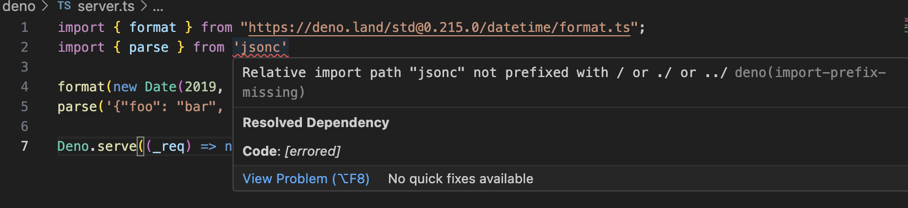
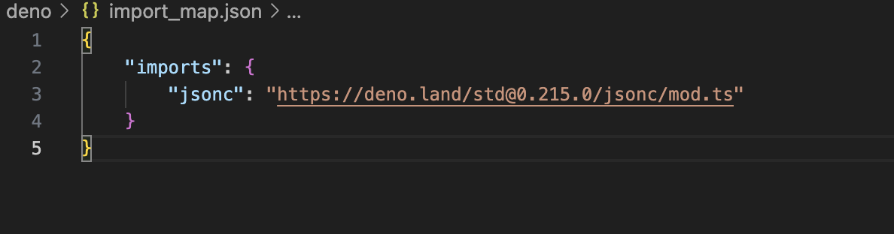

# multiroot workspaceにおいてDeno VSCodeの拡張機能でimportが上手く補完されない

## 概要

リポジトリ内に、Node.js +
TypeScriptのディレクトリとDenoのディレクトリが両方存在する中で
Denoディレクトリ内でVSCodeの拡張機能のDenoのLSPが上手く動かないケース。

- https://github.com/denoland/vscode_deno/issues/974
- https://github.com/denoland/vscode_deno/issues/488#issuecomment-905927175
- https://github.com/microsoft/vscode-extension-samples/blob/2eb7bad1195e4270ce93a179aa45f18efa0f953e/lsp-multi-server-sample/server/src/server.ts

サブディレクトリ内で上手くいかない？

- https://github.com/denoland/deno/issues/20210

`workspace`機能が削除された

- https://github.com/denoland/deno/pull/21891

VSCode拡張側で上手くいっていない可能性

- https://github.com/denoland/deno/issues/21769
  手元で再現してみると、import_map経由のmodulespecifierが解決できない模様 URL
  modulespecifierは解決できている 
  

- コードを見ていると、deno lsp server側の実装を変更する必要がありそう

## コードリーディング

`deno.config`は現状一つのconfigしか想定していない

- https://github.com/denoland/vscode_deno/issues/787
- https://github.com/denoland/deno/blob/5596de8081970a6fa811b95e60a27dca071a714e/cli/lsp/config.rs#L468

`package.json`は`settings.json`があるフォルダから上階層へと捜査し、見つかったところで探索終了する

- https://github.com/denoland/deno/blob/5596de8081970a6fa811b95e60a27dca071a714e/cli/lsp/language_server.rs#L682

## 考察

`deno.enablePaths`が有効なディレクトリでは、そのディレクトリにある`package.json`を解決するのが良いはず...?

## 結論

multirootでプロジェクトを上手く動かすためのDeno側のデザインがまだ固まり切っていないため、もう少し様子見した方が良さそうです。
