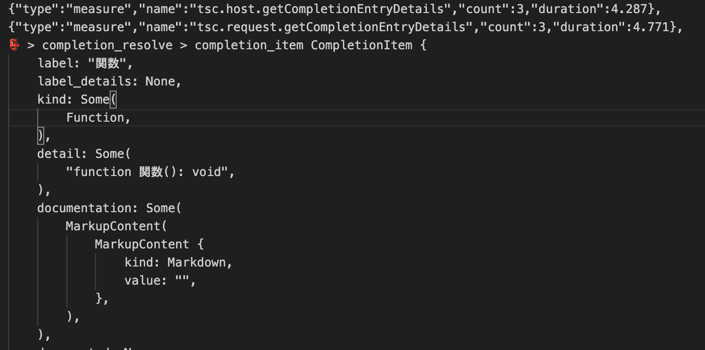
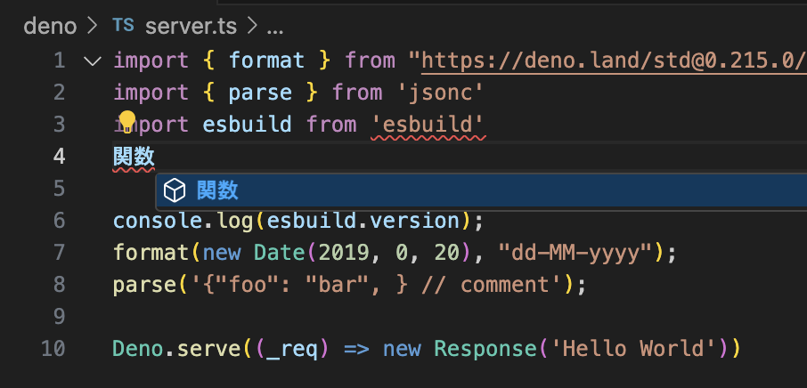

# VSCodeでDenoのmodulespecifierがURLエンコードされた状態で表示される

## 概要

- https://github.com/denoland/deno/issues/18983 関連するissue
  - https://github.com/denoland/deno/issues/12065
  - https://github.com/denoland/vscode_deno/issues/517
  - https://github.com/denoland/deno/issues/10810
    - stdinの問題なので、大元のissueのtestのものと同じ

非ASCII圏の人にとっては使いづらいものになっています。

## 原因

deno
lsp内部でmodulespecifierはURLとして扱っているため、ローカルのファイルパスに非ASCII文字が含まれる場合などで、パーセントエンコードされて表示されてしまっています。

## 直すべき箇所

### completion

関数名などのサジェスト時のパスの文字列
関数名などのサジェストを確定させた時の文字列
modulespecifierの文字列入力中のサジェスト

### hover

modulespecifierをhoverした時の文字列
modulespecifierの右端の方をhoverした時の文字列

### rename

ファイルリネーム時

### diagnostics

パスの打ち間違いなどのhoverした時の文字列

## LSPのデバッグ

https://zenn.dev/_username/scraps/d8334667e3a183

## 解決まで辿り着くために

どこを変えればUIに表示される部分が変更されるのか、着手した段階では全く検討がつかないため、気合いでログを仕込んでその出力を見ます。

下記の画像の例では、関数の横に表示されている立方体のアイコンをまず変えられる処理がどこにあるのかを探りました。

- https://github.com/denoland/deno/blob/77b90f408c4244e8ee2e4b3bd26c441d4a250671/cli/lsp/tsc.rs#L1414

該当の箇所を `lsp::CompletionItemKind::TEXT`
などに変更することでアイコンが変更されることがわかりました。
あとはひたすらそれっぽいところをログに出力して実装すべき箇所を探ります。

## メモなど

ゼロ幅スペースを挿入する処理の経緯が不明なので聞いてみるとよさそうです。

- https://github.com/denoland/deno/pull/11090/files

## PRとはあまり関係ないけどLSP関連の資料

https://microsoft.github.io/language-server-protocol/specifications/lsp/3.17/specification/
https://code.visualstudio.com/api/language-extensions/language-server-extension-guide
https://zenn.dev/mtshiba/books/language_server_protocol

## stdoutのファイルパスのnon-ASCII文字

runtime の処理はここ

- https://github.com/denoland/deno/blob/f49abcc1ac3de72bf894ccfc0102d83ec19f1d46/runtime/fmt_errors.rs#L25

test reporterの処理はここ

- https://github.com/denoland/deno/blob/f49abcc1ac3de72bf894ccfc0102d83ec19f1d46/cli/tools/test/fmt.rs#L12
