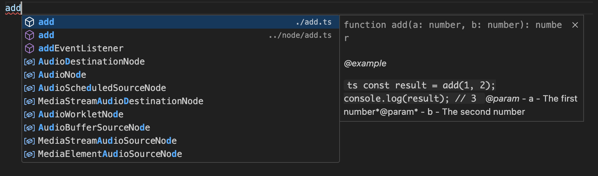
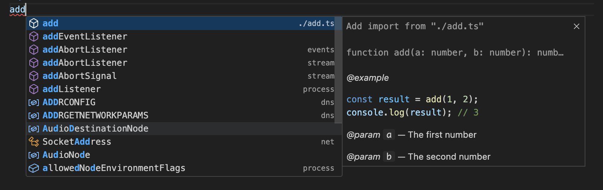

# LSPの補完表示が特定条件で表示が壊れる

## 概要

https://github.com/denoland/deno/issues/23820
https://github.com/denoland/deno/pull/23822

```ts
/**
 *
 * @example
 * ```ts
 * const result = add(1, 2);
 * console.log(result); // 3
 * ```
 *
 * @param {number} a - The first number
 * @param {number} b - The second number
 */
export function add(a: number, b: number) {
  return a + b;
}
```

前述のようなファイルがあるとします。
これをimportしようとすると下記のような表示が壊れたものになっています。



Node.jsプロジェクトで試してみると下記のようになっています。
`"typescript": "5.3.3"`



[JavaScriptのmodulespecifierがURLエンコードされた状態で表示される-01](./2024-02-16.md)でUIに表示させるアイコンを変えるためのコードを変更したことを思い出して、
これと距離が近いものを探っていけば直すべきコードに近づけそうです。

この`completion_item`をログ出力してみます。

https://github.com/denoland/deno/blob/6084cf60ba0786a82aae60ad179187f17bb7dc14/cli/lsp/language_server.rs#L2192

```bash
...

👺 > completion_resolve > : CompletionItem {
    label: "add",
    label_details: None,
    kind: Some(
        Function,
    ),
    detail: Some(
        "function add(a: number, b: number): number",
    ),
    documentation: Some(
        MarkupContent(
            MarkupContent {
                kind: Markdown,
                value: "\n\n*@example*  \n```ts\nconst result = add(1, 2);\nconsole.log(result); // 3\n```\n*@param* - a - The first number*@param* - b - The second number",
            },
        ),
    ),
    ...
```

テキストの箇所は`MarkupContent`という名前のデータ型のようです。

https://microsoft.github.io/language-server-protocol/specifications/lsp/3.17/specification/#markupContent

この`value`を整形してみると下記のようになりました。

```md
*@example*  
```ts
const result = add(1, 2);
console.log(result); // 3
```*@param* - a - The first number*@param* - b - The second number
```

## 原因

文字列処理の中で、コードブロックの終端が改行`\n`で終えていないことによるものでした。
また、hover時には特に表示が壊れていないようです。


## 直すべき箇所

## メモなど

TypeScriptのLSPと表示をよく見比べると、現状Deno LSPでは[JSDoc](https://jsdoc.app/tags-param)の`@param`タグの`type`を正しくパース出来ていないようです。
下記は[該当する処理の近く](https://github.com/denoland/deno/blob/1a788b58a0e80c4504a0fdf5d47db41c46dc8d37/cli/lsp/tsc.rs#L1324)で仕込んだログ出力です。

```bash
👺 > display_parts [
    SymbolDisplayPart {
        text: "a",
        kind: "parameterName",
        target: None,
    },
    SymbolDisplayPart {
        text: " ",
        kind: "space",
        target: None,
    },
    SymbolDisplayPart {
        text: "- The first number",
        kind: "text",
        target: None,
    },
]
👺 > text: "a - The first number"
👺 > body: ["", "The first number"]
👺 > display_parts [
    SymbolDisplayPart {
        text: "b",
        kind: "parameterName",
        target: None,
    },
    SymbolDisplayPart {
        text: " ",
        kind: "space",
        target: None,
    },
    SymbolDisplayPart {
        text: "- The second number",
        kind: "text",
        target: None,
    },
]
👺 > text: "b - The second number"
👺 > body: ["", "The second number"]
```